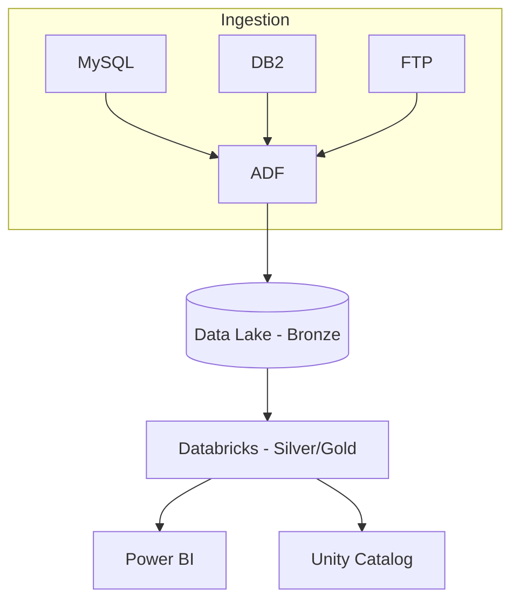

# 01 — Arquitetura

Diagramas e decisões de arquitetura.

## Diagrama Lógico

## Decisões (ADR)
- **Formato de armazenamento**: Delta Lake para ACID + time travel.
- **Orquestração**: ADF para conectividade híbrida e/ou DBX Workflows.
- **Dados sensíveis**: Segredos via Databricks Secrets/Key Vault.
