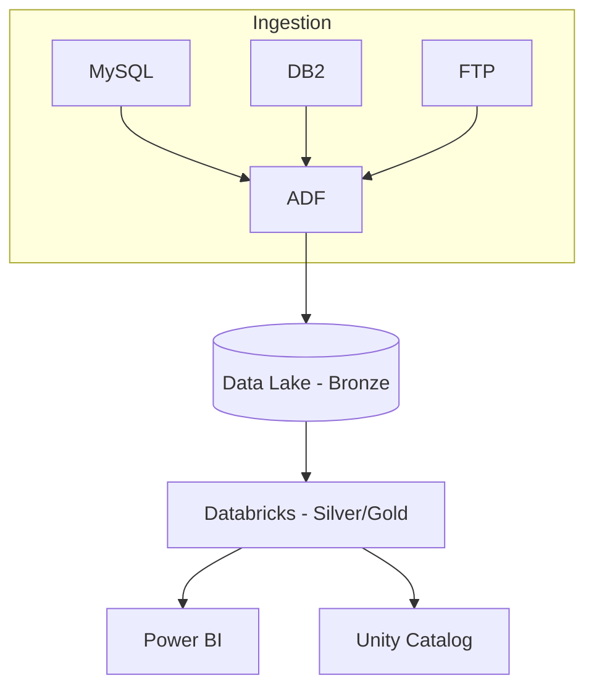
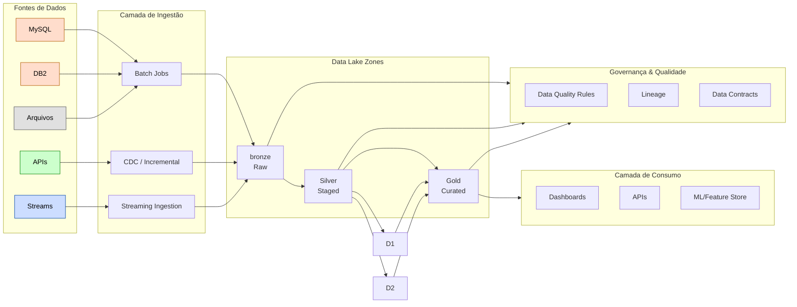
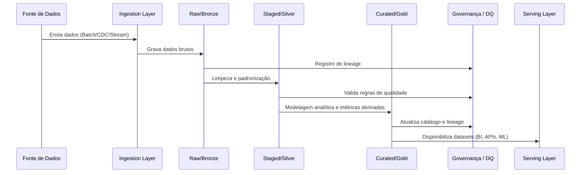
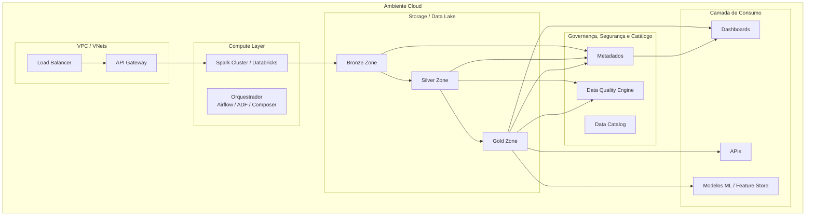

# 1 — Arquitetura do Projeto 

## 1.1 - Objetivo da Arquitetura

A arquitetura deste projeto foi desenhada para demonstrar uma jornada completa de **cloudification de pipeline de dados**, cobrindo ingestão, transformação, qualidade, 
governança e disponibilização de dados em uma arquitetura moderna, escalável e resiliente. 

O propósito deste módulo é: 
- Fornecer **uma visão macro** da plataforma de dados proposta. 
- Explicar as **decisões arquiteturais** adotadas. 
- Descrever como os componentes se relacionam dentro do fluxo completo. 
- Servir como base para os demais diretórios do portfólio (infra, ingestion, governance, pipelines etc).

Diagramas e decisões de arquitetura.

## Visão Geral da arquitetura
A arquitetura segue um padrão baseado em camadas, amplamente utilizado em projetos modernos de engenharia de dados.

[Fontes] → [Ingestion] → [Bronze] → [Silver] → [Gold] → [Serviços]

## Diagrama Lógico

### ADR-001 — Formato de armazenamento
**Decisão:** Usar Delta Lake.  
**Por quê:** Precisamos de ACID, time travel, merge otimizado e esquemas evolutivos.  
**Impacto:** Pipelines mais confiáveis, governança mais forte, simplicidade na manutenção.

## Camadas Principais
### Ingestion Layer 
Responsável por adquirir dados de diferentes origens: 
- Bancos Legados(MySQL, DB2)
- Arquivos estruturados e semi estruturados
- APIs internas/externas
- Streams (eventos)
Métodos de Ingestão
- Batch (incremental e full load)
- CDC(Change Data Capture), quando aplicável
- Micro-Batches

### Data Lake Zones
Para fins didáticos, seguirei as três zonas classícas: 

CAMADA                      | Finalidade
**RAW (Bronze)**            | Dados brutos, sem alterações, preservam integridade da origem
**Staged/Refined (Silver)** | Padronização, limpeza, conformidade de tipos e schema
**Curated/Semantic (Gold)** | Modelos analíticos prontos para consumo

### Transformation Layer
Nesta etapa estarão
- Regras de negócio
- Padronização de schemas
- Tratamento de tipos, anomalias e valores faltantes
- Agregações, conformidade e derivação de atributos
- Modelagem analítica (Dimensional ou Data Vault)
Ferramentas/abordagens típicas: 
- Spark / Pyspark
- dbt
- Beam
- SQL engines distribuídos

### Governance & Quality Layer
Composto por: 
- Data quality rules(completeness, validity, uniqueness...)
- Data Lineage (rastreamento de origem → destino)
- Data Contracts entre produtores e consumidores
- Metadados técnicos e de negócios 
- Monitoramento e documentação viva

### Orchestration Layer
Define dependências, agendamentos e trigger conditions. Exemplos comuns são:
- Airflow
- Databricks Workflows
- AWS Step Functions / GCP Composer / Azure Data Factory

### Serving Layer
Consumo final para: 
- Dashboards (Power BI, Looker, Tableau)
- Microserviços
- APIs
- Feature Stores
- Aplicações IA e modelos ML

## Decisões Arquiteturais
As principais decisões para este projeto incluem: 
### Cloud First Strategy
Toda a arquitetura foi desenhada para rodar nativamente em ambientes cloud, garantido: 
- Elasticidade
- Cost governance
- Security by design
- Observabilidade
### Data Lake como núcleo
Por garantir: 
- Baixo custo de armazenamento
- Escalabilidade quase ilimitada 
- Flexibilidade de formatos e estruturas
- Separação entre storage e compute
### Processamento distribuído
Utilização de sistemas escaláveis para transformação massiva de dados, garantido: 
- Performance
- Resiliência
- Paralelização automática
### Orquestração desacoplada
Separar a lógica de negócio da lógica de agendamento e dependências. 
### Modelo de Segurança Zero-Trust
Incluindo:
- Roles segregadas
- Controle de acesso por camadas 
- Encryption at rest e in transit
- Governança de metadados e owners por domínio

## Benefícios da Arquitetura
- Escalabilidade horizontal
- Redução de acoplamento entre etapas
- Observabilidade completa do pipeline
- Tratamento adequado de dados legados
- Modularidade (cada diretório do repositório mostra um pedaço isolado)
- Excelente como **portfólio profissional**

## Arquitetura Lógica em Camadas

## Pipeline end-to-end

## Arquitetura Física (Genérica p/ Cloud)

