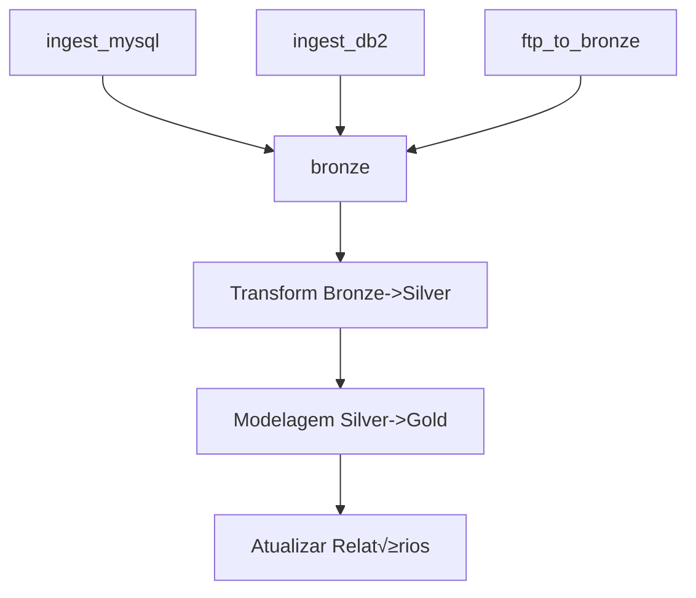

# Diagrama do Workflow

```mermaid
flowchart TB
  ingest_mysql-->bronze
  ingest_db2-->bronze
  ftp_to_bronze-->bronze
  bronze-->silver[Transform Bronze->Silver]
  silver-->gold[Modelagem Silver->Gold]
  gold-->reports[Atualizar Relatórios]
```
