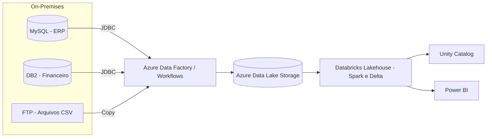

# 🚀 DataFlow Logistics — Cloudification Project

Projeto completo de **migração e modernização** de sistemas legados **on‑premises** para uma arquitetura **cloud Lakehouse (Databricks + Azure)**. Este repositório foi pensado como **portfólio de engenharia de dados** com código, diagramas, governança e CI/CD.

> **Elevator pitch:** Migration and modernization of the organization’s legacy on‑premises systems as part of a broader cloud adoption and digital transformation initiative.

## 🏗️ Arquitetura Alvo (Visão Geral)



## 📂 Estrutura do Repositório

```
01-architecture/
02-datalake-design/
03-ingestion/
04-transformations/
05-orchestration/
06-analytics/
07-data-governance/
08-ci-cd/
09-infrastructure/
.github/workflows/
```

## 🧰 Stack
- **Databricks (PySpark, Delta Lake)**
- **Azure Data Lake Storage**
- **Azure Data Factory / Databricks Workflows**
- **Power BI**
- **Great Expectations**, **Unity Catalog**
- **GitHub Actions** (CI/CD)

## ▶️ Como Executar Localmente (dev)
1. Crie ambiente:
   ```bash
   python -m venv .venv && source .venv/bin/activate
   pip install -r requirements.txt
   cp .env.example .env
   # Preencha as variáveis no .env (NÃO COMMITAR)
   ```
2. Rode testes e linters:
   ```bash
   ruff check .
   pytest -q
   ```
3. Em Databricks, use **secrets** no lugar do `.env` (ver `03-ingestion/ingestion-readme.md`).

## 📐 Padrões Lakehouse (Bronze / Silver / Gold)
As camadas e convenções estão em `02-datalake-design/`.

## 🔒 Segurança e Governança
- Unity Catalog para permissões e catálogo de dados.
- Great Expectations para validação de qualidade.

## 🗺️ Roadmap
- [x] Estrutura inicial do repositório
- [x] .gitignore e LICENSE (MIT)
- [x] Diagramas (Mermaid)
- [x] Scripts de ingestão (MySQL, DB2, FTP)
- [x] Transformações (Bronze→Silver→Gold)
- [x] CI básico com GitHub Actions
- [x] Terraform (Azure + Databricks)
- [ ] Exemplos Power BI (mock)
- [ ] Exemplo de ADF export real

## 📄 Licença
MIT — veja `LICENSE`.

---

> Dica: você pode copiar o conteúdo desta pasta para o seu repositório existente.
