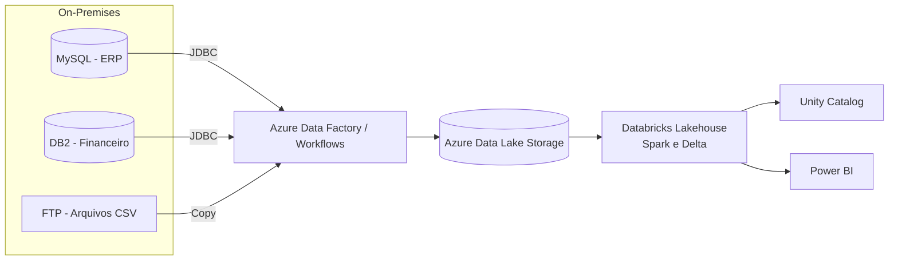

@@ -1,91 +1,58 @@
# 09 — Infrastructure as Code (Terraform)

# 🚀 DataFlow Logistics — Cloudification Project
Infraestrutura do projeto provisionada com **Terraform**: Azure + Databricks + Data Lake + ADF + Key Vault.

Projeto completo de **migração e modernização** de sistemas legados **on‑premises** para uma arquitetura **cloud Lakehouse (Databricks + Azure)**. Este repositório foi pensado como **portfólio de engenharia de dados** com código, diagramas, governança e CI/CD.
## Pré-requisitos
- **Terraform 1.6+**
- **Azure CLI** autenticado (`az login`)
- Permissões na assinatura Azure para criar RG, Storage, KV, ADF e Databricks

> **Elevator pitch:** Migration and modernization of the organization’s legacy on‑premises systems as part of a broader cloud adoption and digital transformation initiative.

## 🏗️ Arquitetura Alvo (Visão Geral)



## 📂 Estrutura do Repositório
> Autenticação: o provider `azurerm` usa a sessão do Azure CLI por padrão. O provider `databricks` é configurado via `azure_workspace_resource_id`, usando sua identidade do Azure (sem precisar de PAT).

## Estrutura
```
01-architecture/
02-datalake-design/
03-ingestion/
04-transformations/
05-orchestration/
06-analytics/
07-data-governance/
08-ci-cd/
.github/workflows/
09-infrastructure/
├── backend.tf                 # (Opcional) backend remoto em Azure Storage (comentado)
├── providers.tf               # providers azurerm e databricks
├── versions.tf                # versões mínimas
├── variables.tf               # variáveis de root
├── main.tf                    # orquestra módulos
├── outputs.tf                 # saídas úteis
├── env/
│   ├── dev.tfvars            # var-file ambiente dev
│   └── prod.tfvars           # var-file ambiente prod
└── modules/
    ├── azure/
    │   ├── main.tf
    │   ├── variables.tf
    │   └── outputs.tf
    └── databricks/
        ├── main.tf
        ├── variables.tf
        └── outputs.tf
```

## 🧰 Stack
- **Databricks (PySpark, Delta Lake)**
- **Azure Data Lake Storage**
- **Azure Data Factory / Databricks Workflows**
- **Power BI**
- **Great Expectations**, **Unity Catalog**
- **GitHub Actions** (CI/CD)

## ▶️ Como Executar Localmente (dev)
1. Crie ambiente:
   ```bash
   python -m venv .venv && source .venv/bin/activate
   pip install -r requirements.txt
   cp .env.example .env
   # Preencha as variáveis no .env (NÃO COMMITAR)
   ```
2. Rode testes e linters:
   ```bash
   ruff check .
   pytest -q
   ```
3. Em Databricks, use **secrets** no lugar do `.env` (ver `03-ingestion/ingestion-readme.md`).

## 📐 Padrões Lakehouse (Bronze / Silver / Gold)
As camadas e convenções estão em `02-datalake-design/`.
## Como usar (DEV)
```bash
cd 09-infrastructure
az login
az account set --subscription "<SUBSCRIPTION_ID>"

## 🔒 Segurança e Governança
- Unity Catalog para permissões e catálogo de dados.
- Great Expectations para validação de qualidade.
terraform init
terraform plan  -var-file=env/dev.tfvars
terraform apply -var-file=env/dev.tfvars
```

## 🗺️ Roadmap
- [x] Estrutura inicial do repositório
- [x] .gitignore e LICENSE (MIT)
- [x] Diagramas (Mermaid)
- [x] Scripts de ingestão (MySQL, DB2, FTP)
- [x] Transformações (Bronze→Silver→Gold)
- [x] CI básico com GitHub Actions
- [ ] Exemplos Power BI (mock)
- [ ] Exemplo de ADF export
## Backend remoto (state) — opcional
Edite `backend.tf` e crie previamente um Storage Account/Container para `tfstate`. Depois rode:
```bash
terraform init -migrate-state
```

## 📄 Licença
MIT — veja `LICENSE`.
## Dica
- O módulo `azure` cria: Resource Group, ADLS Gen2 (containers bronze/silver/gold), Key Vault,
  Data Factory e **Azure Databricks Workspace**.
- O módulo `databricks` conecta no workspace criado e (opcionalmente) cria recursos internos
  como um **cluster de engenharia** e um **SQL Warehouse** simples.

---
> Desative recursos Databricks se não tiver permissões suficientes definindo `enable_databricks_resources = false` no `*.tfvars`.
